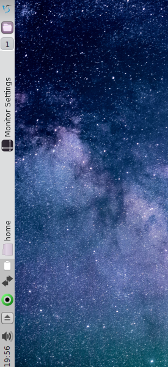

# Silverbar

Silverbar is a theme for the LXQt desktop. It looks best when used with a vertical taskbar.

## Screenshot

## Installing

Copy the Silverbar folder to the ~/.local/lxqt/themes folder.
Then select the Silverbar in the Appearance options.
